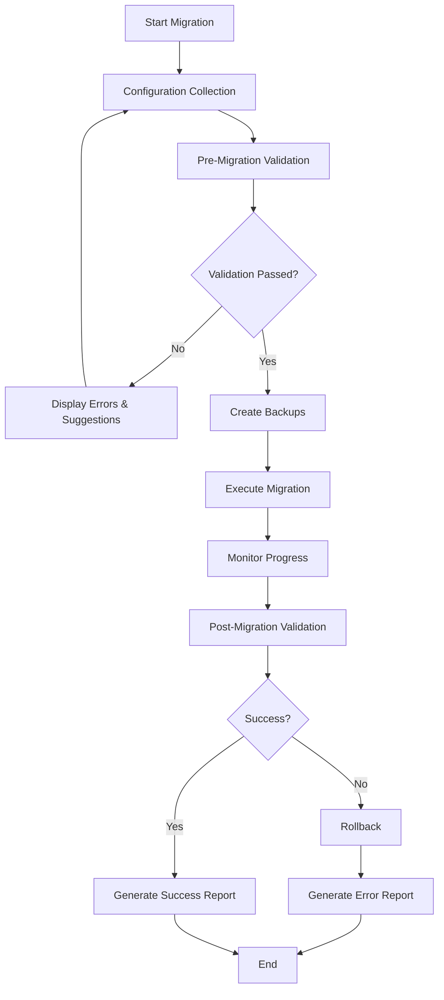

# Design Document

## Overview

The Web & Database Migration Assistant is a comprehensive Python-based tool that provides both CLI and API interfaces for migrating web applications and databases between different systems, platforms, and environments. Built with Python 3.11+, it offers an interactive CLI using Click and Rich for guided migrations, and a FastAPI-based REST API for programmatic access. The tool follows a structured workflow: configuration collection → validation → execution → monitoring → reporting, with support for common platform presets and multi-tenant operations.

## Architecture

### Core Components

```
┌─────────────────────────────────────────────────────────────┐
│                    Migration Assistant                      │
├─────────────────────────────────────────────────────────────┤
│     CLI Layer (Click + Rich)    │    API Layer (FastAPI)    │
├─────────────────────────────────────────────────────────────┤
│  Configuration Manager  │  Validation Engine  │  Executor   │
├─────────────────────────────────────────────────────────────┤
│           Migration Orchestrator & Progress Monitor         │
├─────────────────────────────────────────────────────────────┤
│  File Transfer │  Database Migration │  Control Panel APIs  │
│   (Python +    │    (SQLAlchemy,     │   (cPanel, DA,       │
│    Go hybrid)  │   pymongo, etc.)    │    Plesk)            │
├─────────────────────────────────────────────────────────────┤
│              Backup & Recovery Manager                      │
├─────────────────────────────────────────────────────────────┤
│  Performance Layer (Go)  │        Reporting Engine         │
│  - File Operations       │        - Test Framework         │
│  - Data Processing       │        - Coverage Reports       │
│  - Network Operations    │        - Performance Metrics    │
└─────────────────────────────────────────────────────────────┘
```

### Technology Stack

**Core Languages**: Python 3.11+ with Go 1.21+ for performance-critical operations
- **Python**: Main application logic, API, CLI, and integrations
- **Go**: High-performance file transfers, data processing, and concurrent operations
- Cross-platform support (Linux, macOS, Windows)
- Rich ecosystem of database connectors and cloud SDKs
- Unified codebase for both CLI and API

**CLI Layer**:
- **Click**: Interactive command-line interface with prompts
- **Rich**: Formatted output, tables, progress bars
- **prompt_toolkit**: Advanced multi-step prompts

**API Layer**:
- **FastAPI**: Modern, asynchronous API framework
- Auto-generates OpenAPI documentation
- Supports async DB/file operations
- Authentication: OAuth2, API keys, JWT

**Database Modules**:
- **Relational**: mysql-connector-python, psycopg2, sqlite3, pyodbc
- **NoSQL**: pymongo, redis-py, cassandra-driver
- **Cloud DBs**: AWS RDS, Google Cloud SQL, Azure SQL via SDKs

**File Transfer Modules**:
- **SSH/SCP/SFTP**: paramiko (Python) + Go SSH client for high-performance transfers
- **rsync**: subprocess (Python) + Go rsync implementation
- **FTP/FTPS**: ftputil (Python) + Go FTP client
- **Cloud Storage**: boto3, google-cloud-storage, azure-storage-blob + Go cloud SDKs
- **Containers**: docker-py, kubernetes Python client

**Control Panel Integrations**:
- **cPanel**: cPanel API v2/UAPI integration
- **DirectAdmin**: DirectAdmin API integration
- **Plesk**: Plesk API integration
- **File System Parsing**: Go-based high-performance file parsing for legacy systems

**Performance Layer (Go)**:
- **File Operations**: High-speed file copying, compression, and checksums
- **Data Processing**: Parallel data transformation and validation
- **Network Operations**: Concurrent connections and transfers
- **System Monitoring**: Resource usage tracking and optimization

### System Flow



## Components and Interfaces

### 1. Configuration Manager

**Purpose**: Collects and manages migration configuration through both CLI and API interfaces.

**Key Classes**:
- `ConfigurationCollector`: Handles interactive CLI workflow using Click and prompt_toolkit
- `PresetManager`: Manages common platform presets (WordPress/MySQL, Django/Postgres, etc.)
- `ConfigurationValidator`: Validates configuration using Pydantic models
- `ConfigurationPersistence`: Saves/loads configuration in YAML/TOML format

**Configuration Schema**:
```python
from pydantic import BaseModel
from typing import Optional, Dict, Any

class SystemConfig(BaseModel):
    type: str  # wordpress, django, static, etc.
    host: str
    db_type: Optional[str]
    db_user: Optional[str]
    db_password: Optional[str]
    # ... other fields

class MigrationConfig(BaseModel):
    source: SystemConfig
    destination: SystemConfig
    transfer: Dict[str, Any]
    options: Dict[str, Any]
```

**Example YAML Configurations**:

*Control Panel Migration*:
```yaml
source:
  type: cpanel
  host: shared.hosting.com
  control_panel:
    type: cpanel
    username: cpanel_user
    api_token: "wh_api_token_here"
    port: 2083
  accounts:
    - domain: example.com
      username: example_user
      databases: ["example_db"]

destination:
  type: aws-s3
  host: s3.amazonaws.com
  db_type: aurora-mysql
  cloud_config:
    provider: aws
    region: us-east-1
    bucket: migration-bucket

transfer:
  files: hybrid_sync  # Uses Go for performance
  database: dump_restore
  performance_mode: go_accelerated

options:
  maintenance_mode: true
  backup_before: true
  verify_after: true
  preserve_email_accounts: true
  migrate_dns_records: true
```

*Standard WordPress Migration*:
```yaml
source:
  type: wordpress
  host: 192.168.1.10
  db_type: mysql
  db_user: root
  db_password: secret

destination:
  type: aws-s3
  host: s3.amazonaws.com
  db_type: aurora-mysql

transfer:
  files: s3_sync
  database: dump_restore

options:
  maintenance_mode: true
  backup_before: true
  verify_after: true
```

*Performance Testing Configuration*:
```yaml
testing:
  performance_comparison: true
  benchmark_operations:
    - file_copy
    - checksum_calculation
    - compression
    - database_dump
  test_data_size: 1GB
  iterations: 10
  report_format: html
```

### 2. Validation Engine

**Purpose**: Performs comprehensive pre-migration validation to catch issues early.

**Key Classes**:
- `ConnectivityValidator`: Tests connections to source and destination systems
- `CompatibilityValidator`: Checks compatibility between source and destination
- `PermissionValidator`: Verifies required permissions and access rights
- `DependencyValidator`: Ensures required tools and libraries are available

**Validation Checks**:
- Network connectivity and authentication
- Database schema compatibility
- File system permissions
- Required CLI tools availability (rsync, cloud SDKs, etc.)
- Disk space and resource requirements

### 3. Migration Orchestrator

**Purpose**: Coordinates the entire migration process with proper error handling and rollback capabilities.

**Key Classes**:
- `MigrationOrchestrator`: Main coordination logic
- `StepExecutor`: Executes individual migration steps
- `ProgressTracker`: Monitors and reports progress
- `ErrorHandler`: Manages errors and rollback procedures

**Migration Steps**:
1. Pre-migration backup creation
2. Maintenance mode activation (if enabled)
3. File transfer execution
4. Database migration execution
5. Post-migration validation
6. Maintenance mode deactivation
7. Cleanup and reporting

### 4. File Transfer Module

**Purpose**: Handles file transfers using Python libraries and various protocols.

**Supported Methods with Python Libraries**:
- **SSH/SCP/SFTP**: paramiko library for secure transfers
- **rsync**: subprocess calls with proper error handling
- **FTP/FTPS**: ftputil library for traditional file transfers
- **Cloud Storage**: 
  - AWS S3: boto3
  - Google Cloud Storage: google-cloud-storage
  - Azure Blob: azure-storage-blob
- **Container Volumes**: 
  - Docker: docker-py
  - Kubernetes: kubernetes Python client
- **Archive Transfer**: zipfile/tarfile with manual copy

**Key Classes**:
```python
class TransferMethodFactory:
    @staticmethod
    def create_transfer_method(method_type: str) -> TransferMethod:
        # Factory pattern implementation

class ParamikoTransfer(TransferMethod):
    def __init__(self, ssh_config: SSHConfig):
        self.ssh_client = paramiko.SSHClient()
    
class BotoS3Transfer(TransferMethod):
    def __init__(self, aws_config: AWSConfig):
        self.s3_client = boto3.client('s3')

class DockerTransfer(TransferMethod):
    def __init__(self, docker_config: DockerConfig):
        self.docker_client = docker.from_env()
```

### 5. Database Migration Module

**Purpose**: Handles database migrations using Python database connectors and cloud SDKs.

**Supported Databases with Python Libraries**:
- **Relational Databases**:
  - MySQL/MariaDB: mysql-connector-python
  - PostgreSQL: psycopg2
  - SQLite: sqlite3 (built-in)
  - SQL Server: pyodbc
  - Oracle: cx_Oracle
- **NoSQL Databases**:
  - MongoDB: pymongo
  - Redis: redis-py
  - Cassandra: cassandra-driver
- **Cloud Databases**:
  - AWS RDS: boto3 + database-specific connectors
  - Google Cloud SQL: google-cloud-sql + connectors
  - Azure SQL: azure-identity + pyodbc

**Migration Methods**:
- **Dump & Restore**: Using database-specific tools via subprocess
- **Direct Transfer**: Using SQLAlchemy for cross-database transfers
- **Cloud Migration Services**: AWS DMS, Azure DMS via SDKs
- **Streaming**: Real-time replication using database-specific tools

**Key Classes**:
```python
class DatabaseMigrationFactory:
    @staticmethod
    def create_migrator(db_type: str) -> DatabaseMigrator:
        # Factory pattern for database-specific migrators

class MySQLMigrator(DatabaseMigrator):
    def __init__(self, config: MySQLConfig):
        self.connection = mysql.connector.connect(**config.dict())

class PostgreSQLMigrator(DatabaseMigrator):
    def __init__(self, config: PostgreSQLConfig):
        self.connection = psycopg2.connect(**config.dict())

class MongoMigrator(DatabaseMigrator):
    def __init__(self, config: MongoConfig):
        self.client = pymongo.MongoClient(config.connection_string)
```

### 6. Platform Adapters

**Purpose**: Provides platform-specific handling for different system types, including control panels.

**Adapter Types**:
- **Static Site Adapter**: HTML/CSS/JS file handling
- **CMS Adapter**: WordPress, Drupal, etc. with database + files
- **Framework Adapter**: Django, Laravel, etc. with dependencies
- **Container Adapter**: Docker/Kubernetes migrations
- **Cloud Adapter**: Cloud-specific optimizations
- **Control Panel Adapters**: cPanel, DirectAdmin, Plesk integrations

**Control Panel Integration**:
```python
class ControlPanelAdapterFactory:
    @staticmethod
    def create_adapter(panel_type: str) -> ControlPanelAdapter:
        # Factory for control panel adapters

class CPanelAdapter(ControlPanelAdapter):
    def __init__(self, config: CPanelConfig):
        self.api_client = CPanelAPI(config.host, config.username, config.api_token)
    
    async def extract_accounts(self) -> List[HostingAccount]:
        # Extract hosting accounts via cPanel API
        
    async def extract_databases(self) -> List[DatabaseInfo]:
        # Extract database configurations
        
    async def extract_email_accounts(self) -> List[EmailAccount]:
        # Extract email configurations

class DirectAdminAdapter(ControlPanelAdapter):
    def __init__(self, config: DirectAdminConfig):
        self.api_client = DirectAdminAPI(config.host, config.username, config.password)

class PleskAdapter(ControlPanelAdapter):
    def __init__(self, config: PleskConfig):
        self.api_client = PleskAPI(config.host, config.api_key)
```

**Key Classes**:
- `PlatformAdapterFactory`: Creates appropriate adapters
- `StaticSiteAdapter`, `CMSAdapter`, `FrameworkAdapter`: Specific implementations
- `ControlPanelAdapterFactory`: Creates control panel-specific adapters
- `CPanelAdapter`, `DirectAdminAdapter`, `PleskAdapter`: Control panel implementations
- `DependencyManager`: Handles platform-specific dependencies
- `ConfigurationMigrator`: Migrates platform configurations

### 7. Backup & Recovery Manager

**Purpose**: Creates backups and handles rollback scenarios.

**Key Classes**:
- `BackupManager`: Creates and manages backups
- `RollbackManager`: Handles rollback procedures
- `BackupStorage`: Manages backup storage locations
- `RecoveryValidator`: Validates backup integrity

**Backup Types**:
- File system snapshots
- Database dumps
- Configuration backups
- Cloud resource snapshots

### 8. API Layer (FastAPI)

**Purpose**: Provides REST API for programmatic migration management.

**Key Features**:
- Auto-generated OpenAPI documentation
- Async support for long-running migrations
- Multi-tenant support with tenant isolation
- Authentication: OAuth2, API keys, JWT

**API Endpoints**:
```python
from fastapi import FastAPI, Depends
from pydantic import BaseModel

app = FastAPI(title="Migration Assistant API")

@app.post("/migrations/")
async def create_migration(config: MigrationConfig, tenant_id: str = Depends(get_tenant)):
    # Create and start migration
    return {"session_id": "uuid", "status": "started"}

@app.get("/migrations/{session_id}/status")
async def get_migration_status(session_id: str):
    # Return migration progress and status
    return {"status": "running", "progress": 45, "current_step": "file_transfer"}

@app.get("/presets/")
async def list_presets():
    # Return available migration presets
    return {"presets": ["wordpress-mysql", "django-postgres", "static-s3"]}

@app.post("/migrations/{session_id}/rollback")
async def rollback_migration(session_id: str):
    # Trigger migration rollback
    return {"status": "rollback_started"}
```

### 9. Performance Layer (Go)

**Purpose**: Provides high-performance operations for file transfers, data processing, and system monitoring.

**Go Modules**:
- **File Operations**: High-speed file copying, compression, and checksum calculation
- **Data Processing**: Parallel data transformation and validation
- **Network Operations**: Concurrent connections and optimized transfers
- **System Monitoring**: Resource usage tracking and performance metrics

**Python-Go Integration**:
```python
import subprocess
import json
from typing import Dict, Any

class GoPerformanceEngine:
    def __init__(self):
        self.go_binary_path = "./bin/migration-engine"
    
    async def high_speed_copy(self, source: str, destination: str, options: Dict[str, Any]) -> Dict[str, Any]:
        """Use Go binary for high-performance file operations"""
        cmd = [
            self.go_binary_path,
            "copy",
            "--source", source,
            "--destination", destination,
            "--options", json.dumps(options)
        ]
        result = await asyncio.create_subprocess_exec(*cmd, stdout=subprocess.PIPE, stderr=subprocess.PIPE)
        stdout, stderr = await result.communicate()
        return json.loads(stdout.decode())
    
    async def parallel_checksum(self, file_paths: List[str]) -> Dict[str, str]:
        """Calculate checksums in parallel using Go"""
        cmd = [self.go_binary_path, "checksum", "--files"] + file_paths
        result = await asyncio.create_subprocess_exec(*cmd, stdout=subprocess.PIPE)
        stdout, _ = await result.communicate()
        return json.loads(stdout.decode())
```

**Go Binary Structure**:
```
go-engine/
├── cmd/
│   └── migration-engine/
│       └── main.go
├── internal/
│   ├── fileops/
│   │   ├── copy.go
│   │   ├── checksum.go
│   │   └── compress.go
│   ├── network/
│   │   ├── transfer.go
│   │   └── concurrent.go
│   └── monitoring/
│       ├── resources.go
│       └── metrics.go
└── go.mod
```

### 10. Comprehensive Testing Framework

**Purpose**: Provides extensive test coverage with local testing capabilities and performance benchmarking.

**Testing Architecture**:
- **Unit Tests**: pytest-based with 90%+ coverage
- **Integration Tests**: Docker-based isolated environments
- **Performance Tests**: Go vs Python benchmarking
- **End-to-End Tests**: Complete migration scenarios
- **Mock Services**: Control panel APIs, cloud services, databases

**Test Environment Setup**:
```python
# conftest.py
import pytest
import docker
import asyncio
from typing import Generator

@pytest.fixture(scope="session")
def docker_client():
    return docker.from_env()

@pytest.fixture(scope="session")
def test_databases(docker_client):
    """Spin up test databases in containers"""
    containers = {}
    
    # MySQL test database
    mysql_container = docker_client.containers.run(
        "mysql:8.0",
        environment={"MYSQL_ROOT_PASSWORD": "testpass", "MYSQL_DATABASE": "testdb"},
        ports={"3306/tcp": None},
        detach=True
    )
    containers["mysql"] = mysql_container
    
    # PostgreSQL test database
    postgres_container = docker_client.containers.run(
        "postgres:15",
        environment={"POSTGRES_PASSWORD": "testpass", "POSTGRES_DB": "testdb"},
        ports={"5432/tcp": None},
        detach=True
    )
    containers["postgres"] = postgres_container
    
    # MongoDB test database
    mongo_container = docker_client.containers.run(
        "mongo:6.0",
        ports={"27017/tcp": None},
        detach=True
    )
    containers["mongo"] = mongo_container
    
    yield containers
    
    # Cleanup
    for container in containers.values():
        container.stop()
        container.remove()

@pytest.fixture
def mock_cpanel_api():
    """Mock cPanel API for testing"""
    class MockCPanelAPI:
        def list_accounts(self):
            return [{"user": "testuser", "domain": "test.com"}]
        
        def list_databases(self):
            return [{"name": "testdb", "user": "testuser"}]
    
    return MockCPanelAPI()
```

**Performance Benchmarking**:
```python
import pytest
import time
from migration_assistant.performance import GoPerformanceEngine
from migration_assistant.file_transfer import PythonFileTransfer

@pytest.mark.benchmark
def test_file_copy_performance(benchmark, tmp_path):
    """Benchmark Go vs Python file operations"""
    source_file = tmp_path / "source.txt"
    source_file.write_text("x" * 1024 * 1024)  # 1MB file
    
    go_engine = GoPerformanceEngine()
    python_transfer = PythonFileTransfer()
    
    # Benchmark Go implementation
    go_result = benchmark.pedantic(
        go_engine.high_speed_copy,
        args=(str(source_file), str(tmp_path / "go_dest.txt"), {}),
        rounds=10
    )
    
    # Compare with Python implementation
    python_start = time.time()
    python_transfer.copy_file(str(source_file), str(tmp_path / "python_dest.txt"))
    python_time = time.time() - python_start
    
    assert go_result < python_time  # Go should be faster
```

### 11. Reporting Engine

**Purpose**: Generates comprehensive migration reports for both CLI and API with test coverage metrics.

**Key Classes**:
- `ReportGenerator`: Creates migration reports in multiple formats
- `ProgressReporter`: Real-time progress updates using Rich (CLI) or WebSocket (API)
- `ErrorReporter`: Detailed error reporting with remediation suggestions
- `SummaryReporter`: Migration summary and statistics
- `TestReporter`: Test coverage and performance reports
- `BenchmarkReporter`: Go vs Python performance comparisons

**Report Types**:
- Pre-migration validation report
- Real-time progress report (CLI: Rich progress bars, API: JSON updates)
- Post-migration summary report
- Error and rollback reports
- Test coverage reports with HTML output
- Performance benchmark reports
- Control panel extraction reports

## Data Models

### Migration Session
```python
from pydantic import BaseModel
from datetime import datetime
from typing import List, Optional
from enum import Enum

class MigrationStatus(str, Enum):
    PENDING = "pending"
    RUNNING = "running"
    COMPLETED = "completed"
    FAILED = "failed"
    ROLLED_BACK = "rolled_back"

class MigrationSession(BaseModel):
    id: str
    tenant_id: Optional[str] = None
    config: MigrationConfig
    status: MigrationStatus
    start_time: datetime
    end_time: Optional[datetime] = None
    steps: List[MigrationStep]
    backups: List[BackupInfo]
    reports: List[ReportInfo]
```

### Migration Step
```python
class StepStatus(str, Enum):
    PENDING = "pending"
    RUNNING = "running"
    COMPLETED = "completed"
    FAILED = "failed"
    SKIPPED = "skipped"

class MigrationStep(BaseModel):
    id: str
    name: str
    status: StepStatus
    start_time: Optional[datetime] = None
    end_time: Optional[datetime] = None
    progress: int = 0
    logs: List[LogEntry]
    error: Optional[ErrorInfo] = None
```

### System Configuration
```python
class SystemConfig(BaseModel):
    type: str  # wordpress, django, static, aws-s3, etc.
    host: str
    port: Optional[int] = None
    authentication: AuthConfig
    paths: PathConfig
    database: Optional[DatabaseConfig] = None
    cloud_config: Optional[CloudConfig] = None
```

## Error Handling

### Error Categories
1. **Configuration Errors**: Invalid or missing configuration
2. **Connectivity Errors**: Network or authentication failures
3. **Compatibility Errors**: Incompatible source/destination systems
4. **Transfer Errors**: File transfer or database migration failures
5. **Validation Errors**: Post-migration validation failures

### Error Recovery Strategies
- **Retry Logic**: Automatic retries with exponential backoff
- **Partial Recovery**: Resume from last successful step
- **Full Rollback**: Complete restoration from backups
- **Manual Intervention**: Guided manual recovery steps

### Error Reporting
- Detailed error messages with context
- Suggested remediation steps
- Links to relevant documentation
- Contact information for support

## Testing Strategy

### Unit Testing
- Individual component testing with mocked dependencies
- Configuration validation testing
- Error handling scenario testing
- Platform adapter testing

### Integration Testing
- End-to-end migration workflows
- Database migration testing with test databases
- File transfer testing with test environments
- Cloud service integration testing

### System Testing
- Full migration scenarios with realistic data
- Performance testing with large datasets
- Rollback and recovery testing
- Multi-platform compatibility testing

### Test Data Management
- Synthetic test data generation
- Test environment provisioning
- Automated test cleanup
- Test result reporting

### Testing Tools
- **pytest** for Python unit and integration testing with coverage reporting
- **Go testing** framework for Go module testing and benchmarking
- **Docker & Docker Compose** for isolated test environments
- **pytest-benchmark** for performance testing and Go vs Python comparisons
- **pytest-asyncio** for async operation testing
- **pytest-mock** for mocking external services and APIs
- **coverage.py** for Python code coverage analysis
- **Test databases** in containers (MySQL, PostgreSQL, MongoDB, Redis)
- **Mock control panel APIs** for cPanel, DirectAdmin, and Plesk testing
- **Mock cloud services** for AWS S3, GCS, Azure Blob testing
- **GitHub Actions** for continuous integration and automated testing

## Security Considerations

### Credential Management
- Secure credential storage and transmission
- Support for various authentication methods
- Credential encryption at rest and in transit
- Integration with credential management systems

### Data Protection
- Encryption during transfer
- Secure backup storage
- Data sanitization options
- Compliance with data protection regulations

### Access Control
- Role-based access control
- Audit logging of all operations
- Secure communication protocols
- Network security considerations

## Performance Optimization

### Transfer Optimization
- Parallel file transfers
- Compression during transfer
- Delta synchronization for incremental updates
- Bandwidth throttling options

### Database Migration Optimization
- Batch processing for large datasets
- Parallel data transfer streams
- Index optimization strategies
- Connection pooling

### Resource Management
- Memory usage optimization
- Disk space management
- CPU utilization monitoring
- Network bandwidth management

## Monitoring and Observability

### Progress Tracking
- Real-time progress indicators
- Estimated time remaining
- Transfer rate monitoring
- Step-by-step status updates

### Logging
- Comprehensive operation logging
- Configurable log levels
- Structured logging format
- Log rotation and retention

### Metrics Collection
- Migration performance metrics
- Error rate tracking
- Resource utilization metrics
- Success rate statistics

### Alerting
- Error notifications
- Progress milestone alerts
- Resource threshold warnings
- Completion notifications